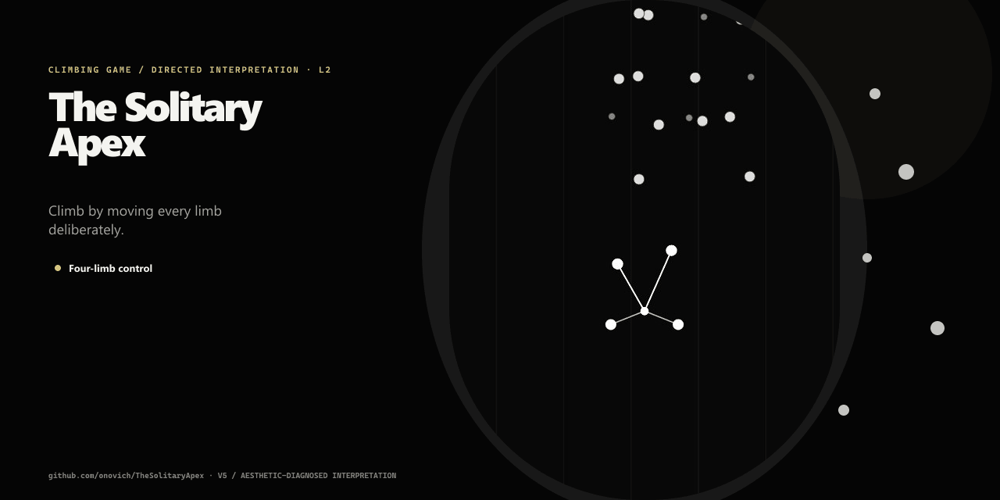

# TheSolitaryApex

[English](README.md)

[在线试玩](https://game.onovich.com/TheSolitaryApex/)

TheSolitaryApex 是一个硬核 2D 攀岩原型。玩家需要分别移动四肢、保护最后一个稳定支点，并在岩壁越来越不留情时管理耐力。



## 玩法

- 把一只手或一只脚拖向可以抵达的岩点。
- 在岩点附近松开，让该肢体附着。
- 保持足够的接触点，避免身体失去平衡。
- 在疲劳无法挽回前使用镁粉和其他有限道具。
- 放置保护点后，向下拉动身体并松开，可以完成更远的 Dyno 动作。
- 抵达顶端；坠落后可以重新开始，尝试另一条路线。

鼠标与触摸使用相同的四肢直接控制方式。

## 主要特点

- 双手与双脚的独立控制。
- 保证可解的路线生成，以及多种手工配置路线模板。
- 伸展距离、平衡、耐力、休息、风力、受伤和坠落系统。
- 镁粉、保护点、能量胶、可收集资源和检查点恢复。
- 易碎岩点、定时岩点、障碍、追逐压力、地震、雪崩和救援遭遇。
- 英文、中文、日文、西班牙文和巴西葡萄牙文界面。
- 路线 Seed、局内配置、关卡检查和数值导出的开发工具。

## 开发

安装依赖并启动 Vite：

```bash
npm install
npm run dev
```

Windows 上可以运行 `StartLocalTest.cmd` 打开本地测试版本，运行 `OpenOnlineTest.cmd` 打开线上游戏。

运行主要的多语言、关卡、玩法和生产构建检查：

```bash
npm run validate
```

常用关卡报告：

```bash
npm run report:levels
npm run report:level -- pursuit-crux-ascent
```

## 当前状态

当前 Web 版本已经可玩，并包含较多路线、移动、生存、遭遇、道具和开发侧配置能力。它仍是持续调节中的原型：内容平衡、上手引导、设备覆盖和专用关卡编辑器都尚未完成。

详细关卡配置与维护说明位于 `docs/level-config-maintenance.md` 和 `docs/level-editor-plan.md`。

## 许可证

当前仓库尚未包含开源许可证。
